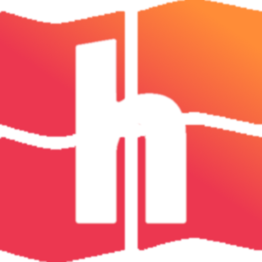
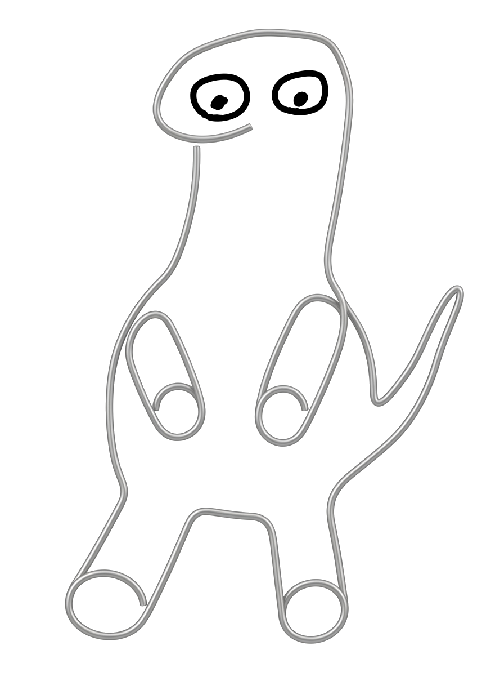
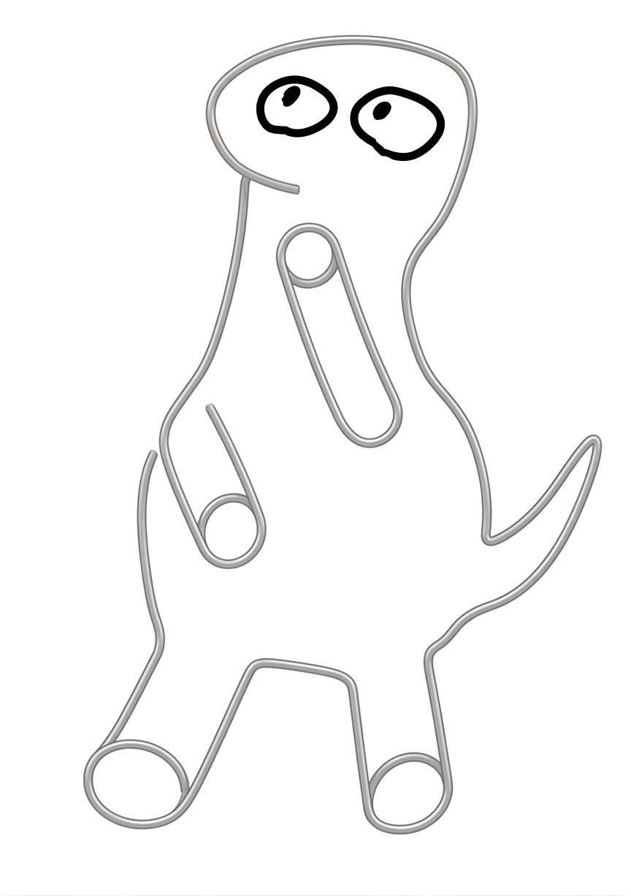
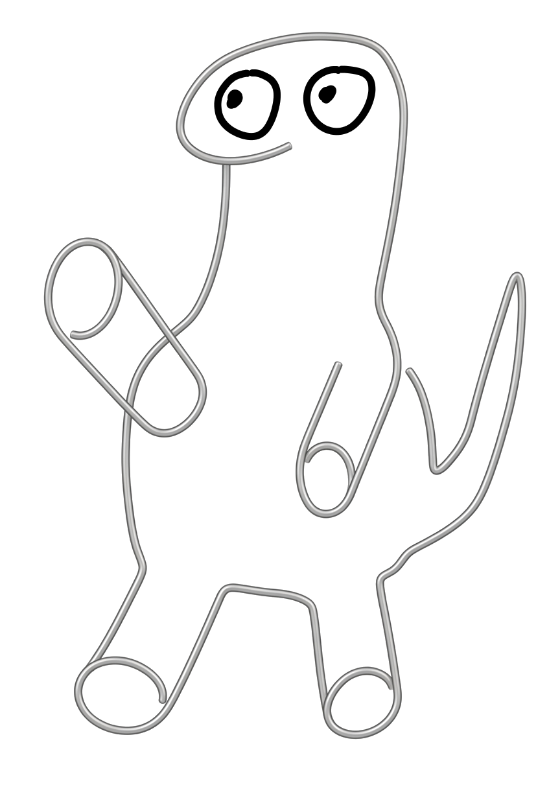

# LowEnd

You Ship: A program that uses the least amount of resources and aligns with the rotating theme
We Ship: Prizes!

My application for the 2026 Hack Club Intership

# Say hello to Orphy!
<!--  -->

  
  
  

The assistant that follows you thoughout the website and never goes away!

# What is the stack?
made in GO and HTMX to at least look like it's optimized, but web pages can't be ultra optimized and look good.

# what is this website inspired by?
Windows xp, the 2000s OS